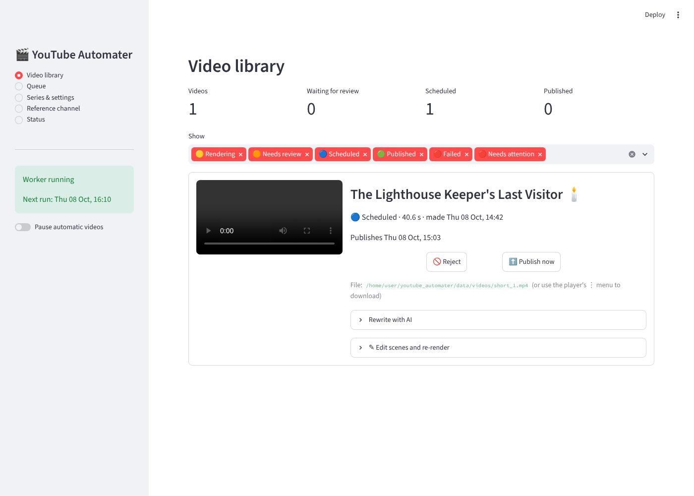
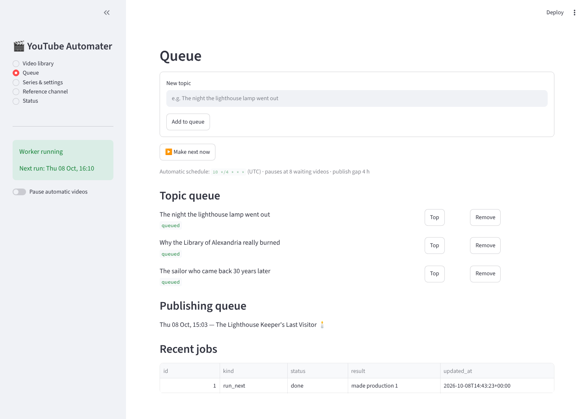
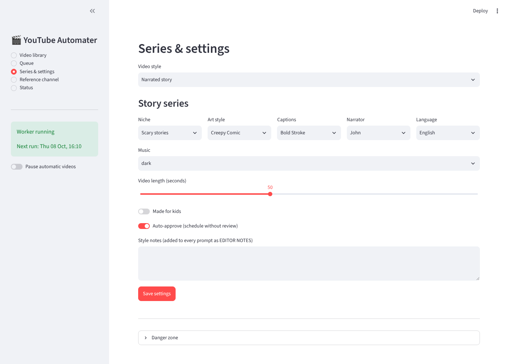
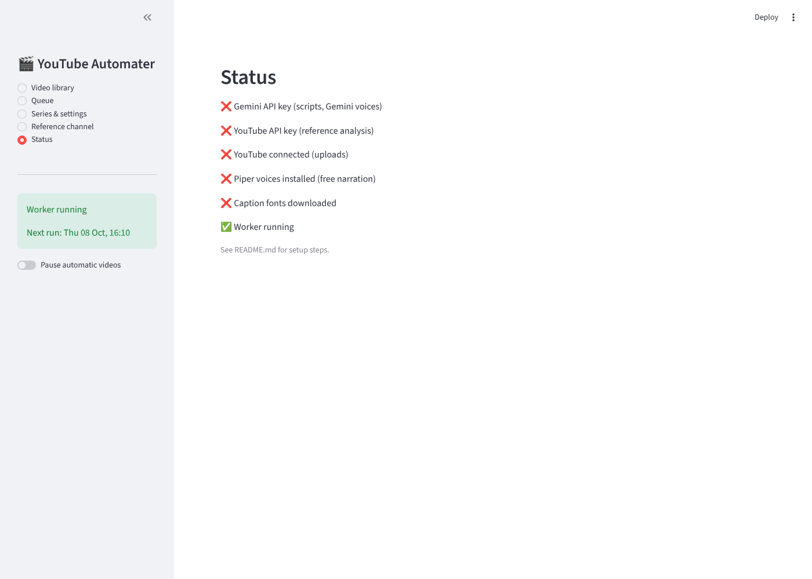

# YouTube Automater

A self-running YouTube **Shorts** factory with a Streamlit dashboard. It takes topics from a queue (or picks
its own from a reference channel's topic gaps), writes the video with AI in one of three styles, renders a
1080×1920 MP4 with voices, music and sound effects, and uploads it on a schedule:

- **Narrated story**: AI pictures per scene, a narrator, word-by-word captions.
- **Cartoon gags**: crude 2D characters on cream paper with voiced speech bubbles.
- **Zoo window**: an animal family at the enclosure glass while visitors react.

This is a Python rebuild of the "Lumen/AgentTube" Node app. The full spec it was built from is in
[HANDOVER.md](HANDOVER.md).

| Library | Queue | Settings | Status |
|---|---|---|---|
|  |  |  |  |

## What's built

| Part | Status |
|---|---|
| **Narrated story** format: 7 niches, 6 art styles, 7 caption styles, 5 narrators, 6 languages | ✅ |
| Images: Pollinations (free) → Gemini → built-in illustrator fallback, cached per scene | ✅ |
| Voices: Piper (free, local) or Gemini TTS, cached | ✅ |
| Synthesized music beds (dark / epic / mystery / soothing) and sound effects, ducking under the voice | ✅ |
| Topic queue, continuous schedule, backlog limit, gap-filling publish slots | ✅ |
| Review flow: approve, reject, publish now, edit scenes → re-render, rewrite with AI | ✅ |
| Reference channel analysis (format, topic gaps, originality check) | ✅ |
| YouTube OAuth + upload (private while the Google app is unverified) | ✅ |
| **Cartoon gags** format: 5 species, 10 moods, 18 actions, 11 props, voiced speech bubbles, punch-in cuts, line boil | ✅ |
| **Zoo window** format: 5 animal families, depth model, 19 actions, visitors reacting, glass fog and paw prints, hand-held camera | ✅ |
| Per-character voices (9 voice types) and synthesized sound effects for every action | ✅ |
| Edit lines, speakers and sounds in the dashboard, then re-render | ✅ |
| "Improve from a reference video" flow, Agents Office | ⏳ planned |

## How it runs

Two processes share one SQLite database in `data/`:

- **Worker** (`python -m ytauto.worker`): makes a video on `SHORTS_SCHEDULE` (every 4 hours by default),
  uploads videos when their slot arrives, and carries out jobs you start from the dashboard. It does all the
  slow work.
- **Dashboard** (`streamlit run app.py`): Video library, Queue, Series & settings, Reference channel and Status
  pages. Buttons queue jobs for the worker, so the page stays responsive.

`./scripts/start.sh` starts both.

## Setup (Mac or Linux)

You need Python 3.10+ and ffmpeg (`brew install ffmpeg` on a Mac). On a Linux server also run
`sudo apt install libegl1` (needed by skia, the cartoon drawing library).

```bash
git clone https://github.com/pdewanganadv1-dot/youtube_automater.git
cd youtube_automater
python3 -m venv .venv && source .venv/bin/activate
pip install -r requirements.txt
cp .env.example .env            # then add GEMINI_API_KEY and YOUTUBE_API_KEY
python scripts/fetch_fonts.py   # caption fonts (Poppins, Anton, Bangers, Lora…)
./scripts/setup_voices.sh       # optional: free Piper narrator voices (~80 MB)
```

**Connect YouTube (for uploads):**

1. In Google Cloud, enable **YouTube Data API v3** and create an OAuth client of type **Desktop app**.
2. Add your Gmail as a test user on the OAuth consent screen.
3. Save the client JSON as `config/client_secret.json` and run `python scripts/connect_youtube.py`.

While the Google app is unverified, uploads are private and the sign-in expires after 7 days. When that happens,
run the connect script again. Each upload costs about 1,600 of the default 10,000 daily quota units, so about
6 uploads a day fit.

**Run it:**

```bash
./scripts/start.sh              # dashboard at http://localhost:8501
```

## Running 24/7

The worker only makes and uploads videos while it is running. Choose one:

- **Your Mac:** keep it awake while the app runs with `caffeinate -i ./scripts/start.sh`, and turn off sleep in
  System Settings → Energy. To start it at login, add a Login Item or a launchd agent that runs `scripts/start.sh`.
- **A small server (about $5–10 a month):** install Python and ffmpeg, copy `.env` and `config/` over securely,
  and run `python -m ytauto.worker` and `streamlit run app.py` as two systemd services.

## Settings reference

All environment variables are listed in [.env.example](.env.example). The most useful ones:

| Variable | Default | Meaning |
|---|---|---|
| `SHORTS_SCHEDULE` | `10 */4 * * *` | Cron (UTC) for automatic videos |
| `SHORTS_MAX_PENDING` | `8` | Pause automatic videos when this many are waiting |
| `SHORTS_PUBLISH_GAP_HOURS` | `4` | Minimum time between uploads |
| `STORY_IMAGES` | `auto` | `pollinations`, `gemini` (needs billing) or `builtin` |
| `CARTOON_TTS` | `auto` | `piper`, `gemini`, or auto-pick |

## Tests

```bash
pytest -q                 # unit tests
RENDER=1 pytest -q        # also does a real MP4 render (~30 s)
```

## Never commit

`.env`, `config/` (OAuth client and tokens), and `data/`. These are already in `.gitignore`.
